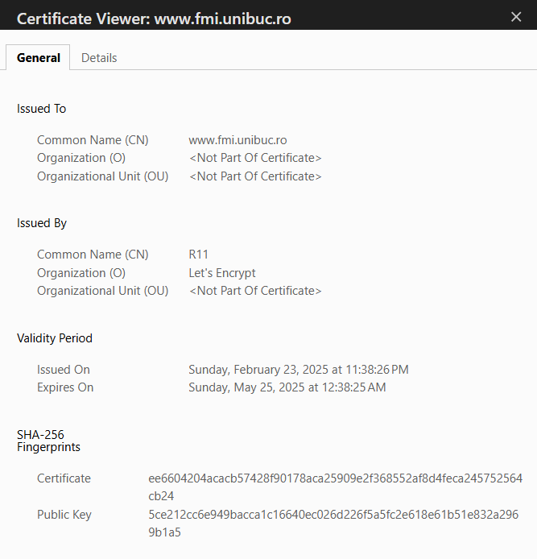

# Lab1
### 1.
- (A) Adversar - (3) O entitate (inclusiv un insider) care acționează rău intenționat pentru a compromite un sistem.

- (B) Securitate - (1) O condiție care rezultă din stabilirea și menținerea măsurilor de protecție care permit unei organizații/sistem să își îndeplinească misiunea sau funcțiile critice, în ciuda riscurilor reprezentate de amenințări.

- (C) Risc - (5) O măsură a gradului în care o entitate este amenințată de o eventuală circumstanță sau eveniment. 

- (D) Vulnerabilitate - (2) Slăbiciune într-un sistem informațional, proceduri de securitate ale sistemului, controale interne sau implementare care ar fi putea fi exploatate sau declanșate de o sursă de amenințare.

- (E) Securitatea cibernetică - (4) Capacitatea de a proteja / apăra spațiul cibernetic de atacuri cibernetice. 

### 2.
L-am vazut :3
### 3.
Convert [here](https://www.rapidtables.com/convert/number/decimal-to-binary.html)

- b10 34 = b2 100010 
- 0xdead = b2 1101111010101101

### 4.
- MIHAIL = (ASCII) 77 73 72 65 73 76 
- (ASCII) 66 82 65 86 79 BRAVO

### 5.
- DOGARU = (base64) RE9HQVJV
- (base64) U3VudCBzdHVkZW50IGxhIEZNSS4= = Sunt student la FMI.

### 6.
- malware - un program rau intentionat, creat cu scopul de a distruge sau infiltra intr un computer
- virus - un tip de malware care atunci cand e executat se va replica in alte computere
- dropper - un tip de trojan creat pentru a instala malware
- downloader - un tip de trojan al carui singur scop e de a instala malwareul in computerul victimeri si necesita acces din retea
- trojan - un malware care se asecunde intr un file/program care pare legitim
- spyware - un malware care monitorizeaza activitatea victimei
- riskware - programe ale caror instalare pot fi un risc potential
- ransomware - un tip de malware care cripteaza datele victimei pana e platit atacatorul
- adware - program care afiseaza reclame si pop-up-uri
- worm - un malware care se replica singur in mai multe computere fara interventia atacatorului
- obfuscare - a face continutul greu de citit

### 7. 
Am cu openBSD si Ubuntu, imi ia 3h sa descarc iso de windows 7

# Lab2

### 1.
- (A) Criptologie - (4) Știința care se ocupă de criptanaliză și - criptografie.
- (B) Criptografie - (2) Disciplina care studiază principiile, mijloacele și metodele de transformare a datelor pentru a ascunde conținutul lor semantic, a preveni utilizarea lor neautorizată sau a preveni modificarea lor nedetectată.
- (C) Criptanaliză - (5) Încercarea de a înfrânge protecția criptografică fără o cunoaștere inițială a cheii utilizate în furnizarea protecției
- (D) Confdențialitate - (1) Asigurarea că informațiile nu sunt dezvăluite entităților neautorizate.
- (E) Integritate - (6) Protejarea împotriva modificării sau distrugerii necorespunzătoare a informațiilor
- (F) Disponibilitate - (3) Asigurarea accesului și utilizării informațiilor în timp util și fiabil

### 2.
- Confidentialitate - Salariile angajaților nu trebuie făcute publice.
- Disponibilitate - Biroul casierie trebuie să aibă acces la salariile angajaților (pentru a realiza plățile).
- Integritate - Un angajat nu își poate modifica singur suma primită ca salariu pe luna în curs.
- Confidentialitate - Un angajat nu ar trebui să afle cât câștiga un coleg fără acordul acestuia (ex. să îi spună
direct).
- Integritate - Biroul casierie trebuie să aibă certitudinea că suma pe care o înmânează angajatului de
plată este cea corectă.

Confidentialitate -> ex: criptare simetrica
Integritate -> ex: SHA-256
Disponibilitate -> nu e asigurata cu primitive criptografice

### 3.
- (F) Un adversar care are la dispoziție un timp infinit pentru criptanaliza unui sistem este un adversar PPT.
- (A) Un adversar PPT are dreptul de a „ghici” cheia.
- (F) Un adversar PPT are la dispoziție algoritmi exponențiali în timp.

### 4. 
1. ne-neglijabila
2. ne-neglijabila
3. neglijabila
4. neglijabila
5. neglijabila
6. ne-neglijabila

### 5.
- securitatea perfecta este imposibil de realizat, este un ideal teoretic
- in securitatea computationala adversarul are resurse finite, adica pot sparge doar sisteme polinomiale sau exponentiale mici, este good enough

### 6.
- exista 2^512 chei posibile
- va dura 2^512 / 2^30 secunde = 2^482 secunde = mult
- deloc eficient


# Lab3
## 1. OTP
### 1.
- text to binary:
```
10100011110111111110010010000100001011011100111101111111011111111111110100001011001000110100001001101101110111001100011100111111001011100110100010100010101101110001110000010001101011000001100101001000010110110111011110011010000000001010001001110001000110011110001010000100001101001000110011110000111001101110000110010110100111011110111110111110001000000001010110111000000101101110001000111010110100001001001011001111101010000110111010110000000101011010101010000101111100010111010001000011111111110000010001100111111011101010001000100011110100101011001010000000001111011110000100000001111100010110000010011111001111001010111111110111
```

- key to binary:
```
11101100101100011000000110100100011110011010011000010010000110101101110101011011010000100010011001001101101110011011010001001011010010110100100011010111110110010011110001100010110001010110101000111100001111100001101010111010011001001100011101010001011110101001000011101101010001001111100010010001100101001000010010110110111011011000101011001100010001100111000011011011011000101100001001001001101110011111010110111010110110100100111011010100011101001100100111100100110100010001000100110000100010110110000101000111100010001100110101001111101111011100000111101001010010011100000101100010100111100001001011111010010111111101101111011001
```

- XORed:
```
01001111 01101110 01100101 00100000 01010100 01101001 01101101 01100101 00100000 01010000 01100001 01100100 00100000 01100101 01110011 01110100 01100101 00100000 01110101 01101110 00100000 01110011 01101001 01110011 01110100 01100101 01101101 00100000 01100100 01100101 00100000 01100011 01110010 01101001 01110000 01110100 01100001 01110010 01100101 00100000 01110000 01100101 01110010 01100110 01100101 01100011 01110100 00100000 01110011 01101001 01100111 01110101 01110010 00100000 01100100 01100001 01100011 01100001 00100000 01100101 01110011 01110100 01100101 00100000 01100110 01101111 01101100 01101111 01110011 01101001 01110100 00100000 01100011 01101111 01110010 01100101 01100011 01110100 00101110 00001010```
```

- plain text:
```
One Time Pad este un sistem de criptare perfect sigur daca este folosit corect.
```

### 2. 
- text to binary:
```
10100011110111111110010010000100001011011100111101111111011111111111110100001011001000110100001001101101110111001100011100111111001011100110100010100010101101110001110000010001101011000001100101001000010110110111011110011010000000001010001001110001000110011110001010000100001101001000110011110000111001101110000110010110100111011110111110111110001000000001010110111000000101101110001000111010110100001001001011001111101010000110111010110000000101011010101010000101111100010111010001000011111111110000010001100111111011101010001000100011110100101011001010000000001111011110000100000001111100010110000010011111001111001010111111110111
```

- plain text to binary:
```
01001111 01110010 01101001 01100011 01100101 00100000 01110100 01100101 01111000 01110100 00100000 01100011 01101100 01100001 01110010 00100000 01110000 01101111 01100001 01110100 01100101 00100000 01101111 01100010 01110100 01101001 01101110 01110101 01110100 00100000 01100100 01101001 01101110 01110100 01110010 00101101 01110101 01101110 00100000 01110100 01100101 01111000 01110100 00100000 01100011 01110010 01101001 01110000 01110100 01100001 01110100 00100000 01100011 01110101 00100000 01001111 01010100 01010000 00100000 01100100 01100001 01110010 00100000 01100011 01110101 00100000 01100001 01101100 01110100 01100001 00100000 01100011 01101000 01100101 01101001 01100101 00101110 00101110
```

- found key in hex:
```
ecad8de748ef0b1a857f032101bdb51f5e07c3c37931c37b3c3219ef748215708cf046a18588c1e2f897ca0076ca7f924eb1e6efcb1b905afed5d110228d24049b8242bec6e11d82699409fa1281d9
```

### 3.
Daca avem:
- k -> cheia
- a, b -> mesajele plain
- a', b; -> mesajele criptate, unde a' = a ^ k, b' = b ^ k

Daca facem a' ^ b' avem:
a^k ^ b^k
k ^ k = 0
x ^ 0 = x, oricare ar fi x


Din astea rezulta:

a' ^ b' = a ^ b
Daca aflam orice informatie despre unul din texte il putem deduce foarte usor pe al2lea


## 2. Sistseme de criptare istorice
### 1.
- Cirful lui Cezar: Shiftam circular literele din alfabet cu k
- Decriptare: Scadem K din fiecare litera
- K poate lua valori de la 1 la 26, un spatiu foarte mic care poate fi verificat exhaustiv, e foarte nesigur

### 2.
- Cirful Column: Testul plain este reprezentat pe linii si coloane, rearanjam ordinea coloanelor
- Decriptare: Folosim cheia pentru a reordona coloanele
- Este mai safe pentru chei lungi (avem multe coloane)
- Atacatorul poate incerca permutari de coloane pana obtine cuvinte si sa intuiasca alte permutari

## 3.
- Letter frequency:
```py
({' ': 162, 'J': 122, 'E': 79, 'G': 71, 'W': 66, 'M': 66, 'H': 62, 'O': 56, 'C': 48, 'F': 45, 'D': 41, 'K': 37, 'N': 36, 'A': 28, 'Q': 24, 'L': 22, 'P': 20, 'V': 19, 'R': 17, 'U': 17, ',': 17, 'B': 16, 'Y': 13, '.': 9, 'X': 6, 'T': 5, 'S': 4, '1': 1, '9': 1, '7': 1, '8': 1, ':': 1, '-': 1, 'I': 1})
```

- English letter frequency:
```py
letterFrequency = {'E' : 12.0,'T' : 9.10,'A' : 8.12,'O' : 7.68,'I' : 7.31,'N' : 6.95,'S' : 6.28,'R' : 6.02,'H' : 5.92,'D' : 4.32,'L' : 3.98,'U' : 2.88,'C' : 2.71,'M' : 2.61,'F' : 2.30,'Y' : 2.11,'W' : 2.09,'G' : 2.03,'P' : 1.82,'B' : 1.49,'V' : 1.11,'K' : 0.69,'X' : 0.17,'Q' : 0.11,'J' : 0.10,'Z' : 0.07 }
```

- Secret Text:


## 4. 


- 4 Martie -> V I III | 06 15 25 | AO BP CX DH GY IQ JW KR LT WS 
- mihai -> nllzy


# Lab4

### 1.
- (A) - (4) O încercare de a păcăli pe cineva să dezvăluie informații
(de exemplu, o parolă) care pot fi folosite pentru a ataca
sisteme sau rețele.
- (B) - (2) O tehnică pentru încercarea de a achiziționa date
sensibile, cum ar fi numerele de cont bancar, printr-o
solicitare frauduloasă prin e-mail sau pe un site web, în care
făptuitorul se maschează ca o afacere legitimă sau o
persoană de încredere.
- (C) - (1) Un tip specific de phishing care vizează membrii de rang
înalt ai organizațiilor.

- (D) - (3) Utilizarea mijloacelor tehnice pentru a redirecționa
utilizatorii către accesarea unui site Web fals, mascat drept
unul legitim și divulgarea informațiilor personale.

- (E) - (6) Un termen colocvial care poate fi folosit pentru a descrie
orice atac de phishing foarte vizat.
- (F) - (5) Falsificarea adresei de trimitere a unei transmisii pentru a
obține intrarea ilegală într-un sistem securizat.

### 2.
- domain name-ul din mail si partea de dupa @ nu par numele bancii
- typo in butonul de validare
- mesajul a fost identificat 'junk'


# Lab5

### 1.
- printeaza
```
Facultatea de Matematica si Informatica
Universitatea din Bucuresti
https://www.youtube.com/watch?v=HIcSWuKMwOw
```


### 2.
- printeaza
```js
undefined:1
WScript.Echo("You have been hacked!");WScript.Echo("I hope you did not run this on your own PC...");var f="Facultatea";var mi="de Matematica si Informatica";var unibuc="Universitatea din Bucuresti";var curs="Curs Info anul 3";var minciuna="Acesta este un malware. Dispozitivul este compromis";var adevar="Stringul anterior este o minciuna";try{var obj=new ActiveXObject("Scripting.FileSystemObject");var out=obj.OpenTextFile("./fmi.txt",2,true,0);out.WriteLine("Bun venit la acest laborator :)");out.Close();var fle=obj.GetFile("./fmi.txt");fle.attributes=2}catch(err){WScript.Echo("Do not worry. Ghosts do not exist!")}
```
- nu creeaza nimic malitios,nu poate fi considerat malware

### 3.
- foloseste codarea hexazecimala ca un alt mod de obfuscare
- ingreuneaza analiza statica


### 4.

- printeaza hello
- dam un objdump si convertim varlorile in ASCII
- 24/61 -> poate fi malware
- daca obfuscam codul va scadea numarul de teste picate


# Lab6
### 1.
- pentru ca numerele sunt generate intr un mod determinist printr o formula simpla
- pe primul candidat da mereu 0

### 2.
- safe la brute force
```py
import secrets
import string

def generate_password(length=10):
    special_characters = ".!$@"
    alphabet = string.ascii_letters + string.digits + special_characters
    
    while True:
        password = ''.join(secrets.choice(alphabet) for _ in range(length))
        if (any(c.islower() for c in password) and
            any(c.isupper() for c in password) and
            any(c.isdigit() for c in password) and
            any(c in special_characters for c in password)):
            return password

password = generate_password()
print(password)
```

- poate fi folosit pentru a genera tokenuri de autentificare sau session-uri

```py
import secrets
url_safe_string = secrets.token_urlsafe(32)
print(url_safe_string)
```

- autentificare
```py
import secrets
token_hex = secrets.token_hex(16)
print(token_hex)

```

- anti timing attack
```py
import secrets
import string
import random

def safe_check(pswd, guess):
    zipped = list(zip(pswd, guess))
    random.shuffle(zipped)
    
    check = 1
    for i,j in zipped:
        if i != j:
            check = 0
            
    print(check)
    return check

def generate_password(length=10):
    special_characters = ".!$@"
    alphabet = string.ascii_letters + string.digits + special_characters
    
    while True:
        password = ''.join(secrets.choice(alphabet) for _ in range(length))
        if (any(c.islower() for c in password) and
            any(c.isupper() for c in password) and
            any(c.isdigit() for c in password) and
            any(c in special_characters for c in password)):
            return password

password = generate_password()
guess = generate_password()


safe_check(password, guess)
```


- 
```py
import secrets

def generate_binary_key(length=100):
    return secrets.token_bytes(length)

binary_key = generate_binary_key(100)
print(binary_key)
```

- pentru a stoca parole safe 


# Lab7
### 1.
- a) fals
- b) fals
- c) adevarat
- d) fals 
- e) fals
- f) fals
- g) adevarat

# Lab9
### 2.
- a) nu ruleaza, cheia are o lungime invalida, datele trebuie si ele sa fie multiplu de 16 24 sau 32 biti
- b) Electronic Code Book
- c) Nu, blocuri similare produc output similar si se pot observa patternuri la criptanaliza
- d) Cheia are 17 bytes, data are 44 bytes la cum l am scris eu
- e) 
```py
from Crypto.Cipher import AES
from Crypto.Util.Padding import pad

key = b'0 cheie oarecare'[:16]
data = b'test'

cipher = AES.new(key, AES.MODE_ECB)
encrypted_data = cipher.encrypt(pad(data, AES.block_size))

print(encrypted_data)

```
- f) OpenPGP mode
    - https://pycryptodome.readthedocs.io/en/latest/src/cipher/classic.html
```py
from Crypto.Cipher import AES
from Crypto.Util.Padding import pad

key = b'0 cheie oarecare'[:16]  # Cheia trebuie să aibă exact 16, 24 sau 32 de byți
data = b'testtesttesttesttesttesttesttesttesttesttest'

cipher = AES.new(key, AES.MODE_OPENPGP)
encrypted_data = cipher.encrypt(pad(data, AES.block_size))

print(encrypted_data)

```

# Lab11

### 1.
- a) A
- b) F
- c) A
- d) A
- e) F
- f) F
- g) F
- h) A
- i) F

### 2.
- trimite email de validare
- metoda userService.SignUp verifica existenta altor conturi cu acelasi email
```py
 [AllowAnonymous]
        [HttpPost("SignUp")]
        public async Task<IActionResult> SignUp([FromBody] SignUpDTO signUpDTO)
        {
            try
            {
                var subject = "Test";
                var content = "SignUp successfull";
                var message = new Models.EmailConfig.Message(new string[]{signUpDTO.Email}, subject, content);
                

                _emailService.SendEmail(message);

                await _userService.SignUp(signUpDTO);
                return Ok(new ErrorResponse()
                {
                    StatusCode = 200,
                    Message = "SignUp successful"
                });
            }
            catch (Exception ex)
            {
                return BadRequest(new ErrorResponse()
                {
                    StatusCode = 400,
                    Message = ex.Message
                });
            }
        }
```

### 3.
- foloseste EntityFramework care preine SQL Injections si Cross Site Scripting
```py
[AllowAnonymous]
        [HttpPost("Login")]
        public async Task<IActionResult> Login([FromBody] LoginDTO login)
        {
            try
            {
                return Ok(new LoginResponseDTO()
                {
                    Id = await _userService.Login(login)
                });
            }
            catch (Exception exception)
            {
                return BadRequest(new ErrorResponse()
                {
                    StatusCode = 500,
                    Message = exception.Message
                });
            }
        }
```

# Lab12

### 1.
- 
- a) Let's Encrypt
- b) 26aprilie 2025 - 25iulie 2025
- c) 2048
- d) 65537, e numar prim, face exponentierea rapida mai rapida pentru ca are doar 2 biti de 1
